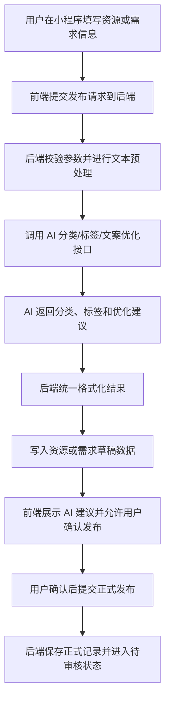
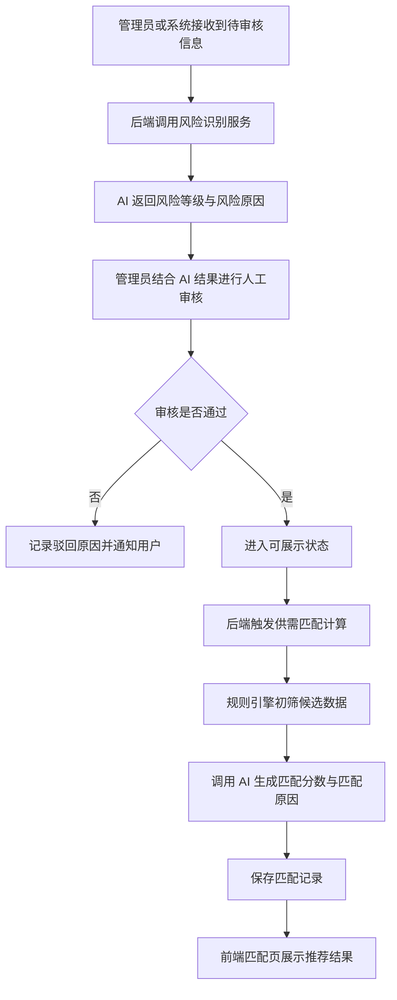
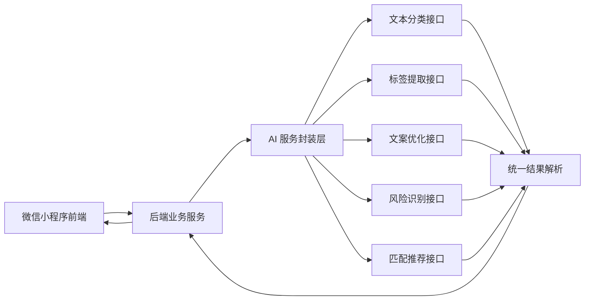

# 益小助项目大纲

## 一、项目名称

**益小助**

副标题：**基于 AI 的校园公益资源智能匹配小程序**

## 二、项目背景

校园中长期存在旧书闲置、物资浪费、失物招领效率低、求助信息分散等问题。传统信息发布方式主要依赖群聊、朋友圈或线下张贴，普遍存在信息不集中、检索困难、匹配效率低、真实性难核验等不足。

本项目依托微信小程序轻量、便捷、易传播的特点，结合 AI 在文本理解、信息提取、内容审核和供需推荐方面的能力，构建一个面向校园场景的公益资源智能匹配平台，帮助闲置资源更高效地流转到真正需要的人手中。

## 三、项目目标

打造一个集“发布、审核、匹配、对接、反馈”于一体的校园公益资源服务平台，实现闲置资源与真实需求的快速连接，提升校园公益资源配置效率，增强学生互助氛围与公益参与体验。

## 四、目标用户

1. 在校学生
2. 学生组织与志愿服务团队
3. 校园管理员或审核人员
4. 有旧物捐赠、教材转赠、失物招领、临时求助需求的师生群体

## 五、应用场景

1. 旧书教材转赠
2. 闲置生活物资捐赠
3. 失物招领信息发布
4. 临时帮扶与爱心求助
5. 公益活动信息组织与参与

## 六、核心功能模块

### 1. 用户登录与身份管理

基于微信授权完成用户登录，建立基础身份信息，便于资源发布、需求提交和记录追踪。系统同时支持演示模式回退，未配置微信参数时可使用离线账号完成功能展示。

### 1.1 身份验证与管理员授权

用户可在设置页提交学号、真实姓名和学院信息完成身份验证。完成验证后，普通用户可继续使用关键发布功能，并可通过一次性管理员邀请码升级为管理员；首个超级管理员由部署人员手动配置。

### 2. 资源与需求发布

支持发布“我有资源”和“我需要资源”两类信息。用户可填写标题、描述、分类、图片、联系方式等内容。

### 3. 资源浏览与搜索

支持按分类浏览资源与需求信息，并提供关键词搜索、状态筛选和时间排序功能，帮助用户快速定位所需内容。

### 4. AI 智能标签提取

系统自动分析用户发布的文本内容，提取资源类别、关键词、适用对象等标签，例如“高数教材”“冬季衣物”“考研资料”等，提升信息规范性和检索效率。

### 5. AI 智能匹配推荐

根据资源信息、需求内容、分类和标签相似度，为用户自动推荐可能匹配的资源或需求对象，提高供需对接效率。

### 6. AI 文案优化

当用户输入内容较短、描述不清时，AI 可辅助补全文案，使发布内容更加完整、规范、易于理解。

### 7. 图片辅助识别

用户上传图片后，系统可辅助识别常见物资类型，如书籍、衣物、文具、小家电等，减少手动填写负担。

### 7.1 ISBN 扫码辅助

针对旧书教材场景，系统支持扫描 ISBN 条码，自动生成教材标题、分类和标签建议，提高发布效率。

### 8. 内容审核与风险识别

系统对发布内容进行基础风险识别，辅助管理员过滤广告信息、无关内容、不文明用语及疑似虚假信息，提升平台健康度。

### 9. 状态流转与反馈

资源和需求可按照“待匹配”“对接中”“已完成”等状态进行管理，形成完整的业务闭环，并支持用户反馈匹配结果。

### 10. 个人中心

用户可查看个人发布记录、需求记录、匹配记录和完成记录，便于统一管理个人操作信息。

## 七、AI 融合亮点

### 1. AI 自动分类

自动识别发布内容所属类别，降低用户手动选择成本。

### 2. AI 标签提取

从自然语言描述中提炼关键词和特征标签，提升检索与匹配准确率。

### 3. AI 供需匹配

结合文本内容、标签信息和分类属性，自动推荐更合适的资源或需求对象。

### 4. AI 文案优化

将用户的简略描述扩展为更规范、更完整的发布内容，提高平台整体信息质量。

### 5. AI 风险识别

对广告、违规、不相关内容进行初步识别，减轻人工审核压力。

### 6. AI 图片辅助录入

通过图片识别辅助判断物资种类，提升信息录入效率和用户体验。

## 八、页面结构设计

### 1. 首页

展示平台公告、分类入口、最新资源、最新需求、热门推荐和 AI 推荐内容。

### 2. 分类页

按照旧书教材、闲置物资、失物招领、爱心帮扶、公益活动等类别展示信息。

### 3. 发布页

支持用户选择“发布资源”或“发布需求”，填写表单信息，并触发 AI 标签提取与文案优化功能。

### 4. 匹配页

展示系统自动推荐的匹配结果，并说明推荐理由，帮助用户快速完成对接。

### 5. 详情页

展示资源或需求的详细信息，包括标题、描述、图片、标签、联系方式、状态信息和相关推荐内容。

### 6. 消息与记录页

用于展示审核通知、匹配通知、对接进度和完成反馈。

### 7. 个人中心

管理个人发布、需求记录、收藏内容和历史匹配结果。

### 8. 后台管理页

供管理员审核发布内容、处理违规信息、查看平台统计数据和管理资源流转状态。

## 九、用户角色与权限设计

为保证平台运行安全、有序，`益小助`采用基于角色的权限控制机制，不同类型用户拥有不同的功能访问范围。系统主要划分为`普通用户`、`管理员`和`超级管理员`三类角色。

### 1. 普通用户

普通用户是平台的主要使用群体，面向全校在校师生开放。用户通过微信授权登录后，可使用平台的基础公益服务功能。普通用户主要具备以下权限：

1. 浏览平台资源与需求信息
2. 按分类、关键词、状态进行搜索和筛选
3. 发布“我有资源”或“我需要资源”信息
4. 上传图片并使用 AI 标签提取、文案优化等辅助功能
5. 查看系统推荐的匹配结果
6. 联系匹配对象并跟踪对接状态
7. 查看个人发布记录、需求记录、匹配记录和完成记录
8. 对已完成的资源对接进行反馈评价

普通用户不能访问后台管理页面，也不能执行审核、删帖、权限分配等管理操作。

### 2. 管理员

管理员主要负责平台内容审核、秩序维护和资源流转管理。为保障平台运行安全，管理员账号不面向普通用户开放注册，而是由系统后台预设或经授权后开通。管理员具备以下权限：

1. 审核用户发布的资源与需求信息
2. 识别并处理广告、虚假信息、不良内容和无关内容
3. 管理资源状态，如“待匹配”“对接中”“已完成”
4. 查看用户举报与异常提示信息
5. 查看平台基础运营数据，如发布数量、匹配数量、完成数量等
6. 对违规内容进行下架或驳回处理

管理员通常不具备系统最高配置权限，不能直接修改系统核心参数或分配其他管理员角色。

### 3. 超级管理员

超级管理员是平台的最高权限管理者，负责系统级配置和权限分配。该角色一般由平台负责人或指导教师担任。超级管理员具备以下权限：

1. 拥有全部管理员权限
2. 新增、修改、停用管理员账号
3. 审核管理员申请并分配角色权限
4. 管理系统分类、公告和基础配置
5. 查看平台整体运行情况与统计分析数据
6. 处理重大违规事件和异常账号问题

### 4. 管理员注册与授权机制

为防止权限滥用，平台不提供面向所有用户的公开管理员注册入口。管理员开通方式包括以下两种：

1. `后台预设`
系统在部署时由开发者或平台负责人直接创建管理员账号，并与指定身份信息绑定。

2. `审核授权`
普通用户提交管理员申请后，由超级管理员审核其身份信息与申请理由。审核通过后，系统将其角色由普通用户升级为管理员。

### 5. 权限控制实现思路

在系统实现中，用户登录后由后端根据其身份标识查询对应角色，并动态返回可访问的功能模块。前端根据角色显示不同页面入口，例如普通用户仅显示资源浏览、发布和匹配功能，而管理员和超级管理员可额外看到后台管理入口。通过这种方式，可以实现前后端结合的权限隔离，确保系统安全性与管理规范性。

## 十、系统业务流程设计

`益小助`围绕校园公益资源的发布、审核、匹配、对接和反馈构建完整业务闭环。系统的核心流程如下：

### 1. 用户登录与身份进入

用户通过微信授权登录系统，首次进入时完成基础身份信息确认。系统根据用户角色加载对应功能模块，普通用户进入前台服务页面，管理员进入后台管理页面。若未配置微信参数，系统可回退至演示登录模式，保证比赛录屏和答辩顺畅。

### 1.1 学号姓名验证与管理员授权

普通用户进入设置页后，可填写学号、真实姓名和学院信息完成身份验证。验证通过后，用户可以继续使用关键功能，并可在需要时输入一次性管理员邀请码，将角色升级为管理员。

### 2. 资源或需求发布

普通用户在发布页中选择“我有资源”或“我需要资源”，填写标题、分类、描述、图片和联系方式等信息。提交前，系统可调用 AI 能力完成标签提取、文案优化、图片辅助识别和 ISBN 扫码辅助，帮助用户提高发布信息质量。

### 3. 内容审核

用户提交后，信息首先进入待审核状态。系统先进行初步风险检测，识别广告、无关内容、不文明用语或疑似虚假信息，再由管理员进行人工审核。审核通过后，信息正式展示在平台前台；审核不通过则返回用户并提示修改原因。

### 4. 资源展示与搜索

通过审核的信息会按照分类展示在首页、分类页和搜索结果页中。用户可根据关键词、资源类别、状态和发布时间进行筛选，快速定位感兴趣的资源或真实需求。

### 5. AI 智能匹配推荐

系统基于资源类别、文本标签、关键词相似度和需求紧急程度，对已发布的信息进行供需匹配。匹配结果将展示在匹配页和详情页中，帮助用户更快找到合适的对接对象。

### 5.1 智能识别辅助录入

在发布阶段，系统支持 ISBN 扫码识别教材信息，以及通过相机或相册图片触发图片识别辅助，自动回填标题、分类、标签和描述建议。

### 6. 用户联系与对接

用户查看匹配结果后，可通过平台提供的联系方式与对方进行线下或线上沟通。双方确认资源可对接后，可将记录状态由“待匹配”更新为“对接中”。

### 7. 完成反馈与状态闭环

当资源成功转交或需求得到满足后，用户可将该条记录标记为“已完成”，并填写简单反馈信息。平台据此形成从发布到完成的完整闭环，便于后续统计和信誉建设。

### 8. 管理员运营管理

管理员在后台可查看待审核信息、处理违规内容、维护资源状态、查看平台数据统计，并根据平台运行情况进行内容管理和秩序维护。超级管理员还可进一步完成权限分配和系统配置管理。

### 9. 业务流程总结

系统整体流程可概括为：

`用户登录 -> 发布资源/需求 -> AI 辅助处理 -> 管理员审核 -> 前台展示 -> AI 智能匹配 -> 用户对接 -> 完成反馈 -> 数据沉淀`

这一流程突出体现了平台“轻量发布、智能匹配、规范审核、闭环流转”的设计思路，也能够较好地展示 AI 在校园公益服务场景中的实际应用价值。

## 十一、技术方案

### 1. 总体技术路线

本项目采用“小程序前端 + RESTful 后端服务 + 关系型数据库 + AI 能力服务”的整体架构。系统以前后端分离方式实现，前端负责页面展示、交互与用户操作，后端负责业务逻辑、权限控制、数据存储和 AI 能力调度，数据库负责平台核心业务数据的持久化管理，AI 服务负责文本理解、标签提取、内容优化、风险识别和智能匹配等能力支持。

从实现可行性、开发效率和比赛周期考虑，推荐采用以下主方案：

- 前端：`微信小程序原生开发`
- 后端：`Node.js + Express`
- 数据库：`MySQL`
- 文件存储：小程序云存储或对象存储
- AI 接入：第三方大模型接口 + 基础规则引擎

这种方案开发门槛适中、部署灵活、演示稳定，较适合学生团队在较短周期内完成一个可运行、可展示、可扩展的竞赛作品。

### 2. 系统架构设计

系统整体可划分为四个核心层次：

#### 2.1 表现层

表现层即微信小程序前端，负责以下任务：

1. 页面渲染与用户交互
2. 表单录入与数据展示
3. 搜索、筛选、分类浏览
4. 匹配结果与通知消息展示
5. 管理员后台页面入口控制

前端通过调用后端提供的接口获取数据，并根据用户角色动态显示普通用户页面或后台管理页面。

#### 2.2 业务层

业务层由后端服务构成，负责平台核心逻辑处理，包括：

1. 用户登录与身份校验
2. 资源与需求的发布、修改、删除
3. 审核状态流转管理
4. 匹配推荐逻辑处理
5. 收藏、反馈、消息通知等业务功能
6. 管理员审核、统计与权限控制

业务层是整个系统的核心，负责把前端请求转化为可执行的业务流程。

#### 2.3 数据层

数据层主要负责存储用户信息、资源信息、需求信息、审核记录、匹配记录、消息记录和权限信息等结构化数据。数据库采用关系型设计，便于后续统计分析、状态管理和多表关联查询。

#### 2.4 AI 能力层

AI 能力层主要负责对前端提交的文本和图片进行智能分析，具体包括：

1. 发布内容分类
2. 标签自动提取
3. 文案规范化优化
4. 基础风险内容识别
5. 供需匹配推荐分数计算

为提高系统稳定性，AI 层建议与规则引擎结合使用，即先用关键词、分类和状态规则做基础过滤，再使用大模型提升理解效果和推荐质量。

### 3. 前端技术方案

#### 3.1 技术选型

前端推荐使用`微信小程序原生开发`。其优点在于：

1. 与比赛赛道完全契合
2. 能直接使用微信登录、页面路由、图片上传等能力
3. 页面演示更贴近真实使用场景
4. 生态成熟，开发文档丰富，适合快速迭代

如果团队已有跨端开发经验，也可选择 `uni-app`，但从校赛展示与稳定性角度看，原生小程序方案更稳妥。

#### 3.2 页面模块划分

前端可划分为以下页面模块：

1. 首页模块：公告、分类入口、推荐内容、最新信息
2. 分类模块：分类浏览、筛选、搜索
3. 发布模块：资源发布、需求发布、AI 辅助表单
4. 详情模块：资源详情、需求详情、相关推荐
5. 匹配模块：智能推荐列表、匹配原因展示
6. 消息模块：审核通知、匹配通知、状态更新
7. 个人中心模块：我的发布、我的需求、我的收藏、我的记录
8. 后台管理模块：待审核列表、驳回处理、统计分析

#### 3.3 前端交互设计要点

1. 发布流程尽量简洁，减少用户输入负担
2. AI 结果以“标签建议”“描述优化建议”的形式展示，增强可理解性
3. 资源状态需显式展示，如“待审核”“待匹配”“对接中”“已完成”
4. 首页突出推荐与分类入口，提高平台可用性
5. 后台管理页面重点突出审核效率和数据概览

### 4. 后端技术方案

#### 4.1 技术选型

后端推荐采用 `Node.js + Express` 构建 RESTful API 服务。主要原因如下：

1. 开发速度快，适合比赛周期
2. 与前端 JavaScript 技术栈一致，降低团队学习成本
3. 适合构建轻量级业务系统
4. 便于对接 AI 接口和第三方服务

如果团队更熟悉 Java 或 Python，也可替换为 `Spring Boot` 或 `Flask`。但从实现效率和项目复杂度平衡来看，`Node.js + Express` 更适合作为主推方案。

#### 4.2 后端功能模块

后端建议按模块组织，主要包括：

1. 用户模块：登录、身份识别、角色查询、个人信息管理
2. 资源模块：资源发布、编辑、删除、详情查看
3. 需求模块：需求发布、编辑、删除、详情查看
4. 审核模块：待审核列表、审核通过、审核驳回
5. 匹配模块：相似度计算、推荐结果生成、匹配记录保存
6. 消息模块：审核通知、匹配通知、状态提醒
7. 管理模块：后台数据统计、角色管理、分类配置
8. AI 服务模块：调用大模型接口并返回处理结果

#### 4.3 接口设计思路

系统接口建议采用 RESTful 风格，典型接口包括：

1. `/api/user/login`：用户登录
2. `/api/resource/create`：发布资源
3. `/api/need/create`：发布需求
4. `/api/resource/list`：资源列表查询
5. `/api/match/recommend`：获取智能匹配结果
6. `/api/admin/review/list`：获取待审核信息
7. `/api/admin/review/pass`：审核通过
8. `/api/admin/review/reject`：审核驳回

接口返回统一采用 `code + message + data` 的结构，便于前后端协同和错误处理。

### 5. 数据库设计方案

#### 5.1 数据库选型

推荐使用 `MySQL` 作为核心数据库，原因如下：

1. 结构化数据管理能力强
2. 适合处理用户、资源、需求、状态、审核记录等多表关联数据
3. 便于后续做统计分析和管理后台报表
4. 学生团队上手快，部署成本低

#### 5.2 核心数据表设计

系统可围绕以下核心数据表进行设计：

1. `user` 用户表  
存储用户编号、昵称、openid、手机号、角色、注册时间、状态等信息。

2. `resource` 资源表  
存储资源标题、描述、分类、图片地址、标签、发布人、审核状态、流转状态、发布时间等信息。

3. `need` 需求表  
存储需求标题、描述、分类、标签、紧急程度、发布人、审核状态、状态信息等内容。

4. `match_record` 匹配记录表  
存储资源与需求的匹配结果、匹配度、匹配原因、创建时间、状态等信息。

5. `review_record` 审核记录表  
存储审核对象、审核人、审核结果、驳回原因、审核时间等信息。

6. `message` 消息通知表  
存储审核通知、匹配通知、状态变更提醒等消息内容。

7. `admin_apply` 管理员申请表  
存储管理员申请信息、申请原因、审核状态、审核结果等内容。

#### 5.3 数据关系说明

1. 一个用户可以发布多条资源信息
2. 一个用户可以发布多条需求信息
3. 一条资源可对应多条匹配记录
4. 一条需求可对应多条匹配记录
5. 一条发布信息可对应一条或多条审核记录
6. 一个用户可接收多条消息通知

### 6. AI 能力接入方案

#### 6.1 AI 使用原则

本项目中的 AI 不作为独立聊天功能存在，而是深度嵌入业务流程，重点服务于信息整理、内容审核和供需匹配。这样既能体现“AI 赋能”的主题，又能避免项目陷入功能空泛的问题。

#### 6.2 AI 功能划分

AI 服务主要承担以下任务：

1. 文本分类：判断信息属于旧书教材、闲置物资、失物招领或爱心帮扶等类别
2. 标签提取：从文本中提取关键词、适用人群、物资特征等标签
3. 文案优化：将简短、模糊的描述转化为完整规范的发布信息
4. 风险识别：识别广告、恶意内容、无关内容和低质量信息
5. 智能匹配：根据内容相似度和标签重合度生成推荐结果
6. 图片辅助识别：识别常见物资图片并返回类别建议

#### 6.3 AI 处理流程

AI 处理流程建议如下：

`用户输入内容 -> 后端接收请求 -> 基础规则预处理 -> 调用 AI 接口 -> 返回标签/分类/优化建议 -> 存入数据库或展示给用户`

其中，基础规则预处理可包括敏感词检测、长度校验、分类初筛等，以减少无效 AI 调用，降低接口成本。

#### 6.4 匹配推荐实现思路

智能匹配可采用“规则匹配 + AI 语义理解”结合的方式实现。基础阶段可通过分类一致性、标签重合数、关键词相似度和发布时间优先级进行打分；提升阶段再结合 AI 生成更自然的匹配原因说明。这样既便于快速落地，也方便答辩时说明技术层次。

### 7. 文件存储与媒体管理

平台中的资源图片、失物照片和部分附件不建议直接存入数据库，而应上传至对象存储或小程序云存储，再由数据库保存文件访问地址。这样可以降低数据库压力，提高系统访问效率。

图片管理应支持以下能力：

1. 图片上传与删除
2. 图片地址回显
3. 多图资源展示
4. 默认图片兜底处理
5. 非法文件类型校验

### 8. 安全与权限控制方案

#### 8.1 登录认证

系统基于微信登录能力获取用户身份标识，后端通过 `openid` 建立用户记录并发放登录态。后续请求通过 token 或 session 机制完成身份校验。

#### 8.2 权限控制

后端根据用户角色对接口权限进行拦截，普通用户仅可访问前台业务接口，管理员可访问审核和管理接口，超级管理员可访问系统配置和权限分配接口。

#### 8.3 内容安全

为降低平台违规风险，系统应结合以下方式进行内容安全控制：

1. 敏感词过滤
2. AI 风险识别
3. 人工审核复核
4. 用户举报机制

#### 8.4 数据安全

1. 联系方式做最小必要展示
2. 关键操作记录日志
3. 重要数据定期备份
4. 接口参数进行合法性校验

### 9. 部署与运行方案

比赛阶段可采用轻量部署方式，确保系统可稳定演示。推荐方案如下：

1. 小程序前端部署在微信开发者工具与小程序平台
2. 后端服务部署在云服务器或本地演示服务器
3. 数据库部署在本地 MySQL 或云数据库
4. 图片资源使用对象存储或本地静态资源目录

若时间有限，也可采用本地联调加演示环境方式完成答辩展示，但需提前准备测试数据与演示账号，保证录屏和现场展示顺畅。

### 10. 技术可行性与扩展性分析

从实现难度上看，本项目核心功能以信息发布、审核和匹配为主，业务逻辑清晰，适合学生团队分工协作完成。前端页面以表单、列表和详情展示为主，开发复杂度适中；后端以常规管理系统逻辑为主，具备较强可实现性；AI 能力以接口调用为主，不依赖复杂模型训练，落地风险较低。

从后续扩展性看，平台未来可进一步增加以下能力：

1. 校园信用积分体系
2. 公益活动报名与签到
3. 地图定位与线下交接点推荐
4. 多轮智能问答助手
5. 数据分析大屏与运营报表

因此，该技术方案不仅满足当前比赛版本的开发需求，也为后续功能升级和实际推广保留了良好的扩展空间。

### 11. AI 接入技术实现方案

#### 11.1 接入方式选择

本项目推荐采用`API 调用方式`接入 AI 能力，而不是在本地部署大模型。原因如下：

1. 比赛周期较短，API 接入开发速度更快
2. 无需额外配置高性能显卡或复杂推理环境
3. 模型效果稳定，更适合直接展示业务能力
4. 后端统一封装后，便于后续更换模型服务商

因此，系统采用“`小程序前端 -> 后端业务服务 -> AI API 服务`”的接入架构，由后端统一管理所有 AI 请求。

#### 11.2 接入架构设计

AI 接入模块位于后端业务层内部，作为独立服务模块存在。其主要职责包括：

1. 接收前端触发的 AI 请求
2. 对输入内容进行参数校验与预处理
3. 根据任务类型选择不同 Prompt 或模型能力
4. 调用第三方 AI 接口
5. 解析返回结果并转换为平台统一数据格式
6. 将可复用结果写入数据库，减少重复调用

建议将 AI 模块拆分为以下子能力：

1. `AiClassifyService`：文本分类服务
2. `AiTagService`：标签提取服务
3. `AiPolishService`：文案优化服务
4. `AiModerationService`：风险识别服务
5. `AiMatchService`：匹配推荐服务
6. `AiImageAssistService`：图片辅助识别服务

#### 11.3 AI 调用触发场景

系统中 AI 调用主要发生在以下场景：

1. 用户发布资源或需求时，触发文本分类、标签提取和文案优化
2. 用户上传图片时，触发图片辅助识别
3. 管理员审核前，触发风险内容初筛
4. 信息审核通过后，触发供需匹配计算
5. 用户进入匹配页时，获取最新推荐结果和推荐原因

#### 11.4 输入预处理机制

为了降低接口成本并提升结果稳定性，后端在调用 AI 前应先进行基础预处理。预处理规则包括：

1. 文本长度校验，过滤空内容或过短内容
2. 特殊字符清洗与格式标准化
3. 敏感词和明显广告词规则初筛
4. 已有标签缓存命中判断
5. 同类请求去重处理

例如，当用户输入“有几本高数书，九成新”时，系统可先做分词与规则判断，再将整理后的内容发送给 AI 服务，从而获得更稳定的分类和标签结果。

#### 11.5 AI 返回结果标准化

为了便于前端渲染和后端存储，所有 AI 返回结果应统一转换为标准结构。建议返回字段包括：

- `taskType`：任务类型
- `success`：是否处理成功
- `category`：识别出的分类
- `tags`：提取出的标签数组
- `polishedText`：优化后的文本
- `riskLevel`：风险等级
- `riskReason`：风险原因
- `matchScore`：匹配分数
- `matchReason`：匹配原因

通过统一返回结构，可以让前端无需关心底层模型差异，直接消费平台封装后的结果。

#### 11.6 缓存与降级策略

为了提升演示稳定性，建议增加基础缓存与降级策略：

1. 相同文本的标签提取结果可短期缓存
2. 匹配结果在审核通过后预计算并缓存
3. AI 服务超时或失败时，回退到规则引擎结果
4. 图片识别失败时，允许用户手动选择分类
5. 文案优化失败时，不阻塞正常发布流程

这样即使 AI 接口不稳定，系统核心业务仍能正常运行，避免答辩演示中断。

### 12. 接口调用流程图

#### 12.1 发布信息时的 AI 调用流程



#### 12.2 审核与匹配阶段的 AI 调用流程



#### 12.3 整体 AI 服务调用链



### 13. 示例 API 设计

以下示例 API 采用 RESTful 风格设计，用于说明本项目 AI 能力接入的接口组织方式。

#### 13.1 AI 文本分类接口

`POST /api/ai/classify`

请求示例：

```json
{
  "text": "有几本高等数学教材，九成新，适合大一学生复习使用"
}
```

响应示例：

```json
{
  "code": 200,
  "message": "分类成功",
  "data": {
    "taskType": "classify",
    "category": "旧书教材",
    "confidence": 0.95
  }
}
```

#### 13.2 AI 标签提取接口

`POST /api/ai/tags`

请求示例：

```json
{
  "text": "有几本高等数学教材，九成新，适合大一学生复习使用"
}
```

响应示例：

```json
{
  "code": 200,
  "message": "标签提取成功",
  "data": {
    "taskType": "tags",
    "tags": ["教材", "高数", "大一", "九成新", "期末复习"]
  }
}
```

#### 13.3 AI 文案优化接口

`POST /api/ai/polish`

请求示例：

```json
{
  "text": "有几本高数书，九成新"
}
```

响应示例：

```json
{
  "code": 200,
  "message": "文案优化成功",
  "data": {
    "taskType": "polish",
    "polishedText": "现有几本高等数学教材，书况较好，约九成新，适合大一学生学习或期末复习使用，可在校内自取。"
  }
}
```

#### 13.4 AI 风险识别接口

`POST /api/ai/moderation`

请求示例：

```json
{
  "text": "低价出售全新商品，校内面交，数量有限"
}
```

响应示例：

```json
{
  "code": 200,
  "message": "风险识别完成",
  "data": {
    "taskType": "moderation",
    "riskLevel": "high",
    "riskReason": "存在明显商业售卖倾向，与公益资源共享场景不符"
  }
}
```

#### 13.5 AI 匹配推荐接口

`POST /api/ai/match`

请求示例：

```json
{
  "resourceId": 101,
  "resourceText": "几本高等数学教材，九成新，适合大一学生",
  "candidateNeeds": [
    {
      "needId": 201,
      "text": "求高等数学复习资料，准备期末考试"
    },
    {
      "needId": 202,
      "text": "需要英语四级复习资料"
    }
  ]
}
```

响应示例：

```json
{
  "code": 200,
  "message": "匹配完成",
  "data": {
    "taskType": "match",
    "matches": [
      {
        "needId": 201,
        "matchScore": 0.92,
        "matchReason": "资源类别一致，关键词高度重合，适用对象匹配度高"
      },
      {
        "needId": 202,
        "matchScore": 0.18,
        "matchReason": "仅为学习资料场景相近，具体学科不匹配"
      }
    ]
  }
}
```

#### 13.6 AI 图片辅助识别接口

`POST /api/ai/image-assist`

请求示例：

```json
{
  "imageUrl": "https://example.com/uploads/book-001.jpg"
}
```

响应示例：

```json
{
  "code": 200,
  "message": "图片识别成功",
  "data": {
    "taskType": "imageAssist",
    "category": "旧书教材",
    "tags": ["教材", "书籍", "学习资料"]
  }
}
```

### 14. AI 模块落地建议

从比赛实现角度看，建议按优先级逐步接入 AI 能力：

1. 第一阶段优先完成文本分类、标签提取、文案优化
2. 第二阶段补充风险识别与匹配推荐
3. 第三阶段再增加图片辅助识别和更复杂的推荐解释

这样可以确保即使时间有限，也能先完成最能体现“AI 赋能”的核心功能，再逐步提升展示效果与系统完整度。

## 十二、项目创新点

1. 将 AI 应用于校园公益资源流转全过程，而不仅限于简单问答场景。
2. 结合微信小程序“轻量、社交、连接”的特点，适配校园高频使用需求。
3. 聚焦真实校园公益场景，兼顾实用价值与落地可行性。
4. 通过智能匹配减少信息分散和资源浪费，提高资源流转效率。

## 十三、预期成果

1. 一个可运行的微信小程序原型或完整系统
2. 一套完整的项目介绍文档
3. 一段 3 分钟以内的功能演示视频
4. 若干典型校园公益应用场景展示

## 十四、项目价值

1. 提升校园闲置资源利用率
2. 降低公益资源获取门槛
3. 增强学生公益参与感与互助氛围
4. 展示 AI 技术在校园服务场景中的实际应用价值

## 十五、总结

“益小助”以校园公益资源匹配为核心，依托微信小程序的便捷使用方式，结合 AI 在分类、审核、推荐和内容优化方面的能力，致力于打造一个轻量、高效、实用的校园公益服务平台。项目既符合“AI 赋能·智创未来”的竞赛主题，也具有明确的落地场景和推广价值，适合作为微信小程序赛道参赛作品进行开发与展示。

## 十六、当前开发同步补充

为保证项目书与当前代码实现保持一致，现补充已落地的开发内容。

### 1. 图片添加与展示

发布页已支持添加图片，用户可从相册或相机选择图片，当前演示版本最多支持 3 张图片。图片会随资源或需求表单一起提交，并在详情页中进行展示和预览。比赛演示阶段可使用微信开发者工具临时图片路径；正式部署时建议接入对象存储或小程序云存储，将图片上传后保存为长期可访问地址。

### 1.1 扫码与图片识别辅助

发布页已增加“使用智能识别”入口，支持扫码 ISBN、相机识别物品和上传图片识别物品三种方式。系统会基于后端 AI 服务返回分类、标签和描述建议，并允许用户手动修改后再提交审核。

### 1.2 真实微信登录与演示回退

后端已接入微信 `code2Session` 登录流程。在配置 `WECHAT_APPID` 与 `WECHAT_SECRET` 后，系统可使用真实微信身份登录；若未配置，则自动回退到演示登录模式，保证开发和展示阶段可用。

### 1.3 学号姓名验证与管理员邀请码

设置页已支持学号、真实姓名和学院信息验证。完成验证后，普通用户可继续使用一次性管理员邀请码兑换管理员权限；首个超级管理员通过数据库手动指定，后续可由超级管理员管理邀请码和管理员角色。

### 2. 双方信誉积分与评价机制

系统已补充双方信誉积分与对接评价功能。资源方和需求方完成对接后，可在匹配页对对方进行 1 到 5 星评分、文字评价和标签评价。评价提交后，系统会根据评分调整被评价方信誉积分，并生成评价通知。

评分与信誉分变化规则如下：

1. 5 星评价：信誉分增加 5 分
2. 4 星评价：信誉分增加 3 分
3. 3 星评价：信誉分增加 1 分
4. 2 星评价：信誉分减少 3 分
5. 1 星评价：信誉分减少 6 分

信誉积分范围控制在 0 到 150 分之间，用于体现用户历史互助行为质量。该机制可以提升平台可信度，鼓励真实发布、及时沟通和按时完成对接，也为后续推荐排序、风险识别和管理员治理提供参考。

### 3. 状态闭环更新

原业务闭环为：

`登录 -> 发布 -> 审核 -> 匹配 -> 对接 -> 完成反馈`

当前实现后，闭环扩展为：

`登录 -> 发布资源/需求 -> AI 辅助处理 -> 管理员审核 -> 智能匹配 -> 用户联系 -> 完成评价 -> 信誉积分更新 -> 消息通知 -> 数据沉淀`

其中“完成评价”和“信誉积分更新”使平台从单次供需撮合升级为具备信用沉淀能力的校园公益互助系统。

### 4. Docker 与 phpMyAdmin 开发环境

项目已配置 Docker Compose 开发环境，包含后端服务、MySQL 数据库和 phpMyAdmin。开发者可通过 Docker Desktop 快速启动本地联调环境，减少手动安装 Node.js、MySQL 和数据库管理工具的配置成本。

开发环境访问地址如下：

```text
后端 API: http://localhost:3000/api/health
数据库检测: http://localhost:3000/api/health/db
phpMyAdmin: http://localhost:8080
MySQL: localhost:3306
```

### 5. 当前已实现接口补充

除原有用户、资源、需求、AI、审核、匹配、消息、收藏等接口外，当前新增评价与信誉相关接口：

1. `POST /api/feedback/create`：提交对接评价
2. `GET /api/feedback/my-list`：获取当前用户相关评价记录
3. `GET /api/feedback/credit/:userId`：获取指定用户信誉信息
4. `POST /api/user/identity/verify`：提交学号姓名验证
5. `POST /api/user/admin-invite/redeem`：使用一次性管理员邀请码
6. `POST /api/ai/isbn-assist`：扫码 ISBN 获取教材信息建议

这些接口与匹配模块、消息模块和个人中心共同构成评价与信誉闭环。

### 6. 数据库补充

用户表增加以下字段：

| 字段名 | 类型 | 说明 |
|---|---|---|
| identity_verified | tinyint | 是否完成学号姓名验证 |
| verified_at | datetime | 验证完成时间 |
| credit_score | int | 用户信誉积分，默认 100 |
| rating_count | int | 收到评价次数 |

新增管理员邀请码表 `admin_invite_code`：

| 字段名 | 类型 | 说明 |
|---|---|---|
| invite_code | varchar(64) | 一次性邀请码 |
| used | tinyint | 是否已使用 |
| disabled | tinyint | 是否已停用 |
| used_by | bigint | 使用人 ID |
| used_at | datetime | 使用时间 |

新增评价表 `feedback`：

| 字段名 | 类型 | 说明 |
|---|---|---|
| id | bigint | 主键 ID |
| match_id | bigint | 对应匹配记录 ID |
| from_user_id | bigint | 评价人 ID |
| to_user_id | bigint | 被评价人 ID |
| rating | tinyint | 星级评分，1 到 5 |
| content | varchar(500) | 文字评价内容 |
| tags | varchar(255) | 评价标签集合 |
| credit_delta | int | 本次评价造成的信誉分变化 |
| created_at | datetime | 创建时间 |
